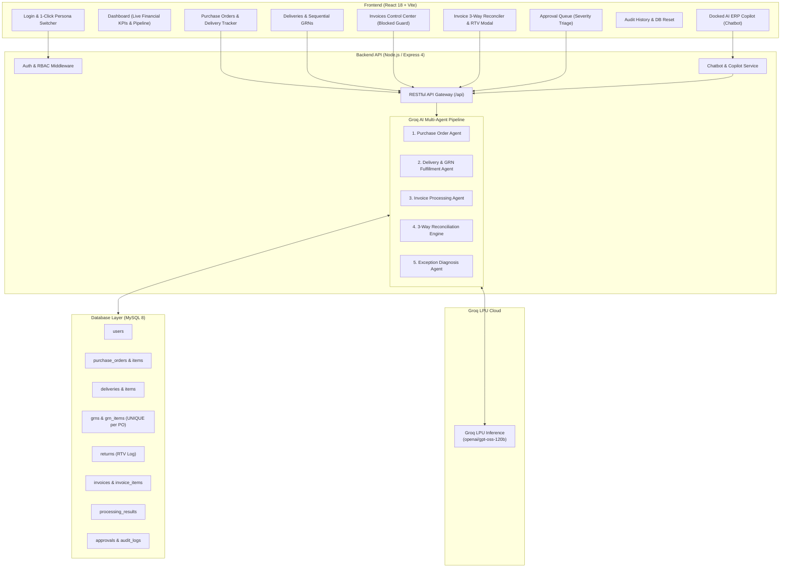
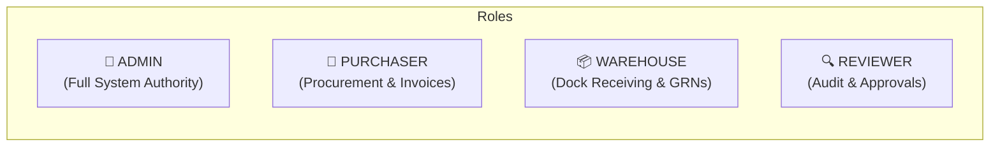

# AI Invoice, Purchase Order & GRN Reconciliation System
## Complete System Architecture, Role-Based Access Control & Screen-by-Screen User Manual

---

## 1. Executive Summary & Problem Statement

In enterprise accounting and supply chain operations, **Accounts Payable (AP)** departments struggle with the **Three-Way Matching Problem**: ensuring that what was ordered via a **Purchase Order (PO)**, what was physically received and inspected at the warehouse dock via a **Goods Received Note (GRN)**, and what the supplier billed on the **Invoice** match in items, quantities, and agreed unit prices.

### Key Pain Points in Traditional Accounts Payable
1. **Manual Data Entry & Human Error**: AP clerks manually cross-check paper or PDF bills against ERP purchase orders and warehouse dock receipts, leading to errors, discrepancies, and delayed vendor payments.
2. **Split & Multi-Lot Deliveries**: Large purchase orders often arrive in multiple shipments across different dates. Legacy systems fail to aggregate multi-lot shipments into a single authoritative receipt, leading to false quantity mismatch rejections.
3. **Premature Invoicing & Payment Leakage**: Invoices frequently arrive before goods are physically inspected at the dock. Processing them prematurely causes payment leakage for unreceived goods.
4. **Surplus Deliveries & Vendor Over-Shipments**: Vendors frequently over-ship products. Without an automated Return to Vendor (RTV) mechanism, companies mistakenly pay for unauthorized surplus items.
5. **Lack of Auditability & Rigid Approval Workflows**: Discrepancies cause friction between procurement, finance, and warehouse teams with no unified audit trail or role segregation.

### The Solution: Autonomous Multi-Agent AI System
This full-stack enterprise application eliminates manual verification friction by combining:
- **Groq LPU Acceleration** (`openai/gpt-oss-120b`) for sub-second agent reasoning, discrepancy root-cause evaluation, and compliance synthesis.
- **Single GRN per PO Architecture** aggregating multi-lot dock receipts.
- **Pre-Generated `BLOCKED` Invoices** locked until physical dock receipt confirmation.
- **Autonomous Return to Vendor (RTV) Workflow** for surplus over-deliveries.
- **Role-Based Access Control (RBAC)** across Admin, Purchaser, Warehouse, and Reviewer personas.
- **Autonomous AI Copilot / Chatbot** with deterministic heuristics and LLM inference for natural language ERP actions (buying items, dock delivery receiving, quantity inspections, and invoice approvals).

---

## 2. High-Level System Architecture



---

## 3. Autonomous Multi-Agent Framework

The system utilizes an automated 5-agent pipeline orchestrated sequentially during invoice reconciliation:

| Agent Name | Primary Responsibility | Input Artifacts | Output Artifacts |
|---|---|---|---|
| **1. Purchase Order Agent** (`poAgent.js`) | Retrieves ERP contract commitments, verifies line items, quantities, agreed unit pricing, and tracks active PO status. | PO Number, Vendor Code | Normalized PO line items, authorized financial commitments. |
| **2. Delivery & GRN Agent** (`deliveryGrnAgent.js`) | Aggregates all incoming dock shipments for a PO, manages the single sequential GRN (`GRN-XXX`), calculates net accepted quantities, records RTV returns, and generates warehouse inspection summaries. | Inbound Shipments, Carrier Tracking, Quality Notes | Single Authoritative GRN, Net Accepted Quantities, Inspection Notes. |
| **3. Invoice Processing Agent** (`invoiceAgent.js`) | Performs strict mathematical validation: line item math (`qty × price = total`), tax rate auditing, subtotal integrity, and format anomaly detection. | Raw Invoice Data / PDF / Spreadsheet | Mathematically validated invoice breakdown, tax audit status. |
| **4. Reconciliation Engine** (`reconciliationAgent.js`) | Executes authoritative 3-way matching across PO, physical GRN, and Invoice. Categorizes outcomes (`3_WAY_MATCHED`, `LESS_RECEIVED`, `MORE_RECEIVED`, `PRICE_MISMATCH`, `LINE_ITEM_MISMATCH`). | PO Items, GRN Accepted Units, Invoice Line Items | 3-Way Comparison Matrix, Matching Status, Quantity & Price Variance. |
| **5. Exception Agent** (`exceptionAgent.js`) | Activated when discrepancies occur. Computes net financial exposure in ₹ INR, classifies business severity (`CRITICAL`, `HIGH`, `MEDIUM`), identifies root causes, and generates actionable recommendations for AP reviewers. | Variance Data, Vendor History | Financial Exposure (₹), Root Cause Diagnosis, Recommended Resolution. |

---

## 4. Multi-User Role-Based Access Control (RBAC)

The application enforces strict separation of duties across 4 distinct personas:



### User Accounts & Default Credentials

| User Name | Role | Email | Password | Primary Authority |
|---|---|---|---|---|
| **Alex Admin** | `ADMIN` | `admin@example.com` | `demo123` | Full unrestricted administrative access across all modules: POs, Invoices, Deliveries, Approvals, Batches, Audit, and DB Reset. |
| **Peter Purchaser** | `PURCHASER` | `purchaser@example.com` | `demo123` | Procurement authority. Create Purchase Orders with line items, upload vendor invoices/bills, and track delivery progress against ordered quantities. |
| **Vikram Warehouse** | `WAREHOUSE` | `warehouse@example.com` | `demo123` | Inbound dock logistics authority. Inspect shipments at the dock, record accepted delivered quantities, and issue sequential Goods Received Notes (GRNs). |
| **Priya Reviewer** | `REVIEWER` | `priya@example.com` | `demo123` | Audit & compliance authority. Inspect 3-way reconciliation discrepancies, review financial exceptions, and sign off approvals or rejections. |

### Permission Matrix

| Feature / Screen | 👑 Admin | 🛒 Purchaser | 📦 Warehouse | 🔍 Reviewer |
|---|:---:|:---:|:---:|:---:|
| **Dashboard** (`/`) | ✅ Full | ✅ Full | ✅ Full | ✅ Full |
| **Purchase Orders List** (`/purchase-orders`) | ✅ View & Create | ✅ View & Create | 👁️ View Only | 👁️ View Only |
| **Create Purchase Order Modal** | ✅ Yes | ✅ Yes | ❌ Blocked | ❌ Blocked |
| **Deliveries & GRNs** (`/deliveries`) | ✅ Full | 👁️ View Only | ✅ Log & Manage | 👁️ View Only |
| **Log Delivery Modal** | ✅ Yes | ❌ Blocked | ✅ Yes | ❌ Blocked |
| **Per-PO Delivery Tracker Modal** | ✅ Yes | ✅ Yes | ✅ Yes | ✅ Yes |
| **Invoices Control Center** (`/invoices`) | ✅ Full | ✅ Full | ❌ Blocked | ✅ Full |
| **Invoice Detail & 3-Way Reconciler** (`/invoices/:id`) | ✅ Full | ✅ Full | ❌ Blocked | ✅ Full |
| **Return Excess Items (RTV) Flow** | ✅ Yes | ✅ Yes | ✅ Yes | ✅ Yes |
| **Approval Queue** (`/exceptions`) | ✅ Yes | ❌ Blocked | ❌ Blocked | ✅ Yes |
| **Approve / Reject Invoices** | ✅ Yes | ❌ Blocked | ❌ Blocked | ✅ Yes |
| **Single & Bulk Upload** (`/upload`, `/bulk`) | ✅ Yes | ✅ Yes | ❌ Blocked | ❌ Blocked |
| **Batch Processing Monitor** (`/batches`) | ✅ Yes | ❌ Blocked | ❌ Blocked | ❌ Blocked |
| **Audit History** (`/audit`) | ✅ Yes | ❌ Blocked | ❌ Blocked | ❌ Blocked |
| **Reset Test Data** | ✅ Yes | ❌ Blocked | ❌ Blocked | ❌ Blocked |
| **AI Copilot (Chatbot)** | ✅ Full | 🛒 Buy & Query | 📦 Log Receiving | 🔍 Inspect & Approve |

---

## 5. Screen-by-Screen User Manual & Visual Guide

This section outlines every screen, modal, and key view in the application, including its purpose, user permissions, key elements, user actions, and placeholder space for visual screenshots.

---

### Screen 1: Login & 1-Click Persona Selector (`/login`)
- **Route**: `/login`
- **Purpose**: Authenticates users and provides instant 1-click persona switching for demonstration, training, and testing.
- **Role Permissions**: Public / Unauthenticated.
- **Key UI Elements**:
  - **1-Click Persona Tiles**: Fast-login buttons for **Alex Admin** (`👑 Admin`), **Peter Purchaser** (`🛒 Purchaser`), **Vikram Warehouse** (`📦 Warehouse`), and **Priya Reviewer** (`🔍 Reviewer`). Clicking any tile automatically fills credentials and signs in.
  - **Manual Credential Form**: Email and password inputs for entering custom or registered credentials.
  - **Live Server Status Indicator**: Displays real-time connectivity to the backend and MySQL database.
- **User Actions**:
  1. Click on any persona tile (e.g. *Peter Purchaser*) or type email and password.
  2. Click **Sign in** button.
  3. The user session is saved in `localStorage`, and the user is redirected to the role-tailored dashboard.

> 📷 **Screenshot Placeholder: Login Screen (`/login`)**  
> *(Insert screenshot showing the split login screen with 1-click persona selection tiles and credentials form)*
>  
> ```
> +--------------------------------------------------------------------------+
> |                                                                          |
> |                         [ SCREENSHOT PLACEHOLDER ]                       |
> |                           Login Screen (/login)                          |
> |                                                                          |
> +--------------------------------------------------------------------------+
> ```

---

### Screen 2: Operations Overview Dashboard (`/`)
- **Route**: `/`
- **Purpose**: High-level command center showing real-time financial health, matching ratios, active AI engine status, and operational throughput.
- **Role Permissions**: Accessible by all roles (`ADMIN`, `PURCHASER`, `WAREHOUSE`, `REVIEWER`), with tailored banners and quick action shortcuts.
- **Key UI Elements**:
  - **Active Role Banner**: Displays the logged-in user name, email, and color-coded role badge (`👑 ADMIN`, `🛒 PURCHASER`, `📦 WAREHOUSE`, `🔍 REVIEWER`).
  - **Financial KPI Cards**:
    - *Total Invoices Processed*: Cumulative count of invoices.
    - *Needs Processing*: Uploaded invoices awaiting reconciliation.
    - *3-Way Matched*: Count and percentage of perfectly matched bills.
    - *Discrepancies / Review*: Count of invoices flagged for human reviewer attention.
    - *Approved by Reviewer*: Successfully cleared invoices.
    - *Rejected Invoices*: Disputed or rejected bills.
  - **Live AI Engine Status Monitor**: Shows the Groq LPU connection state, active model (`openai/gpt-oss-120b`), and inference mode.
  - **5-Stage Pipeline Progress Diagram**: Visual workflow tracker illustrating PO Retrieval $\rightarrow$ GRN Synthesis $\rightarrow$ Math Verification $\rightarrow$ 3-Way Match $\rightarrow$ Exception Diagnosis.
  - **Quick Action Shortcuts**: Role-specific buttons to create POs, log deliveries, or inspect approval queues.
- **User Actions**:
  1. Review system-wide financial and operational health.
  2. Click quick action buttons to jump directly to target workflows.

> 📷 **Screenshot Placeholder: Operations Dashboard (`/`)**  
> *(Insert screenshot showing the executive KPI cards, live AI model badge, and pipeline diagram)*
>  
> ```
> +--------------------------------------------------------------------------+
> |                                                                          |
> |                         [ SCREENSHOT PLACEHOLDER ]                       |
> |                       Operations Dashboard (/)                           |
> |                                                                          |
> +--------------------------------------------------------------------------+
> ```

---

### Screen 3: Purchase Orders Control Center (`/purchase-orders`)
- **Route**: `/purchase-orders`
- **Purpose**: Centralized procurement ledger to establish contracts, track fulfillment progress, and monitor delivery status.
- **Role Permissions**: Accessible by all roles; PO creation restricted to `ADMIN` and `PURCHASER`.
- **Key UI Elements**:
  - **+ Create Purchase Order Button**: Launches the PO creation modal (visible to Admin and Purchaser).
  - **Orders Table**:
    - *PO Number*: Authoritative contract code (e.g., `PO-1001`).
    - *Vendor Name & Code*: Supplier details.
    - *Order Date & Total Contract Value (₹)*: Financial commitment.
    - *Fulfillment Status Badge*: `OPEN`, `PARTIALLY_DELIVERED`, or `DELIVERED`.
    - *Shipment Count & Delivery Progress*: Cumulative shipments received and accepted quantity.
    - *Over-Delivery & Return Badges*: Visual alerts for excess shipments (`+X OVER-DELIVERY`) and vendor returns (`-Y RTV`).
    - *Action Buttons*:
      - `Track Deliveries`: Opens the interactive Per-PO Delivery Tracker Modal.
      - `↩ Return Excess`: Appears automatically when dock received units exceed authorized PO quantity.
- **User Actions**:
  1. Click **+ Create Purchase Order** to open the order modal.
  2. Click **Track Deliveries** to open the detailed fulfillment scorecard.
  3. Click **↩ Return Excess** to initiate an RTV note when surplus goods exist.

> 📷 **Screenshot Placeholder: Purchase Orders Control Center (`/purchase-orders`)**  
> *(Insert screenshot showing the PO list with fulfillment badges, vendor codes, and action buttons)*
>  
> ```
> +--------------------------------------------------------------------------+
> |                                                                          |
> |                         [ SCREENSHOT PLACEHOLDER ]                       |
> |                     Purchase Orders (/purchase-orders)                   |
> |                                                                          |
> +--------------------------------------------------------------------------+
> ```

---

### Screen 4: Create Purchase Order Modal
- **Route**: Modal within `/purchase-orders`
- **Purpose**: Establishes new legally binding ERP purchase orders with line items, quantities, and pricing.
- **Role Permissions**: Restricted to `ADMIN` and `PURCHASER`.
- **Key UI Elements**:
  - **PO Number**: Unique contract identifier (e.g., `PO-2026-005`).
  - **Vendor Selection**: Registered vendors dropdown (e.g., *ABC Supplies*, *XYZ Displays*, *TechSource India*).
  - **Order Date Picker**: Date of order issuance.
  - **Dynamic Line Items Grid**:
    - *Item Name*: Product description.
    - *Quantity*: Ordered units.
    - *Unit Price (₹)*: Agreed rate.
    - *+ Add Item Button*: Add multiple line items dynamically.
  - **Total Order Value**: Real-time sum calculation.
  - **Pre-Generated Invoice Notice**: Highlights that submitting this PO will pre-generate a linked invoice locked in `BLOCKED` status until goods arrive at the dock.
- **User Actions**:
  1. Enter PO number, select vendor, and specify line items with quantities and unit prices.
  2. Click **Create Purchase Order**.
  3. The PO is created with status `OPEN`, and the pre-generated invoice is locked in `BLOCKED` status.

> 📷 **Screenshot Placeholder: Create Purchase Order Modal**  
> *(Insert screenshot showing the PO creation modal with dynamic line items and auto-calculated total)*
>  
> ```
> +--------------------------------------------------------------------------+
> |                                                                          |
> |                         [ SCREENSHOT PLACEHOLDER ]                       |
> |                       Create Purchase Order Modal                        |
> |                                                                          |
> +--------------------------------------------------------------------------+
> ```

---

### Screen 5: Per-PO Delivery Tracker & Scorecard Modal
- **Route**: Modal triggered via **Track Deliveries** on `/purchase-orders` or `/deliveries`
- **Purpose**: Interactive scorecard displaying total shipments received, cumulative accepted vs ordered quantities, remaining balance, visual progress bars, and item-by-item breakdown.
- **Role Permissions**: Accessible by all roles.
- **Key UI Elements**:
  - **Fulfillment Progress Bar**: Visual percentage bar (e.g. `75% Fulfilled` or `100% Complete`).
  - **Summary Metrics Grid**: Ordered Quantity, Gross Received Units, Returned (RTV) Units, and Net Accepted Quantity.
  - **Linked Single GRN Number**: The authoritative sequential GRN (e.g. `GRN-001`) aggregating all shipments for this PO.
  - **Surplus Alert & RTV Action Button**: Highlighted warning box when shipments exceed ordered limits.
  - **Individual Shipments Ledger**: Chronological table showing every delivery slip (`DEL-001`, `DEL-002`), date, and accepted units.
  - **Official RTV Returns History**: Records of all goods returned to vendor with return notes, quantities, and reviewer sign-offs.
- **User Actions**:
  1. Inspect cumulative fulfillment progress.
  2. Click **↩ Return Excess Items to Vendor** if surplus goods are detected.

> 📷 **Screenshot Placeholder: Per-PO Delivery Tracker & Scorecard Modal**  
> *(Insert screenshot showing the delivery scorecard, fulfillment progress bar, and split shipment log)*
>  
> ```
> +--------------------------------------------------------------------------+
> |                                                                          |
> |                         [ SCREENSHOT PLACEHOLDER ]                       |
> |                 Per-PO Delivery Tracker & Scorecard Modal                |
> |                                                                          |
> +--------------------------------------------------------------------------+
> ```

---

### Screen 6: Inbound Deliveries & Goods Receipt Notes (`/deliveries`)
- **Route**: `/deliveries`
- **Purpose**: Warehouse dock operations hub where incoming physical shipments are received, inspected, and consolidated under sequential GRNs.
- **Role Permissions**: Accessible by all roles; logging deliveries restricted to `ADMIN` and `WAREHOUSE`.
- **Key UI Elements**:
  - **+ Log Incoming Delivery Button**: Opens the delivery intake modal.
  - **PO Fulfillment Summary Scorecards**: Visual cards showing active purchase orders and their cumulative dock receiving progress.
  - **Deliveries Table**:
    - *Delivery Number*: Unique shipment slip (e.g., `DEL-001`).
    - *Linked PO & GRN*: The purchase order and single authoritative GRN (`GRN-001`).
    - *Delivery Date*: Date goods arrived at dock.
    - *Vendor & Item Breakdown*: Items and inspected quantities.
    - *Status*: `RECEIVED`.
- **User Actions**:
  1. Click **+ Log Incoming Delivery** to record a new shipment received at the dock.
  2. View linked GRN records and cross-verify physical dock receipts.

> 📷 **Screenshot Placeholder: Inbound Deliveries & GRNs (`/deliveries`)**  
> *(Insert screenshot showing the deliveries table with linked GRNs, PO numbers, and receiving metrics)*
>  
> ```
> +--------------------------------------------------------------------------+
> |                                                                          |
> |                         [ SCREENSHOT PLACEHOLDER ]                       |
> |                    Inbound Deliveries & GRNs (/deliveries)               |
> |                                                                          |
> +--------------------------------------------------------------------------+
> ```

---

### Screen 7: Log Inbound Delivery Modal
- **Route**: Modal within `/deliveries`
- **Purpose**: Records incoming shipments arriving at the warehouse dock, captures inspection quantities, and triggers the Autonomous Agent to link shipments to the PO's single GRN.
- **Role Permissions**: Restricted to `ADMIN` and `WAREHOUSE`.
- **Key UI Elements**:
  - **Delivery Slip Number**: Shipment tracking number (e.g., `DEL-2026-008`).
  - **Target PO Selection**: Dropdown of active purchase orders.
  - **Delivery Date**: Inbound dock receipt date.
  - **Delivered Items & Quantities Grid**: Item name and quantity physically delivered and accepted.
  - **Carrier & Quality Inspection Notes**: Dock notes regarding package condition, seal integrity, and freight carrier.
  - **Automatic Unblock Notice**: Highlights that recording this delivery will automatically unblock the linked `BLOCKED` invoice and trigger 3-way reconciliation.
- **User Actions**:
  1. Fill in delivery slip number, select target PO, specify delivered quantities, and add dock notes.
  2. Click **Record Inbound Delivery & Generate GRN**.
  3. The delivery is recorded, the single PO GRN is updated, and the linked invoice is unblocked and reconciled!

> 📷 **Screenshot Placeholder: Log Inbound Delivery Modal**  
> *(Insert screenshot showing the delivery dock entry modal with target PO selector and carrier notes)*
>  
> ```
> +--------------------------------------------------------------------------+
> |                                                                          |
> |                         [ SCREENSHOT PLACEHOLDER ]                       |
> |                         Log Inbound Delivery Modal                       |
> |                                                                          |
> +--------------------------------------------------------------------------+
> ```

---

### Screen 8: Return Excess Items to Vendor (RTV) Modal
- **Route**: Modal accessible from POs, Deliveries, or Invoice detail views
- **Purpose**: Logs an official Return-to-Vendor note for surplus or defective units, deducts excess units from the warehouse GRN, and automatically re-reconciles the invoice to `3-WAY MATCHED`.
- **Role Permissions**: Accessible by `ADMIN`, `PURCHASER`, `WAREHOUSE`, and `REVIEWER`.
- **Key UI Elements**:
  - **Target PO Number & Item Description**: Contextual details pre-filled from the active discrepancy.
  - **Return Quantity Input**: Units being returned back to the vendor.
  - **Reason for Return Dropdown**:
    - *Excess shipment over authorized PO quantity (Surplus)*
    - *Damaged / Defective units identified during dock inspection*
    - *Incorrect item specification received from vendor*
    - *Contractual order deviation - Vendor over-dispatch*
  - **Carrier & Dispatch Notes**: Gate pass number, freight carrier, and vendor RMA acknowledgment.
  - **Success State View**: Displays the official RTV Note number (`RTV-XXXX`), net accepted inventory, and the updated `3-WAY MATCHED` confirmation badge.
- **User Actions**:
  1. Enter return quantity, select reason, and input carrier dispatch notes.
  2. Click **↩ Confirm & Return Units to Vendor**.
  3. The system logs the RTV note, updates warehouse inventory, and restores the 3-way match.

> 📷 **Screenshot Placeholder: Return to Vendor (RTV) Modal**  
> *(Insert screenshot showing the RTV modal with return reason dropdown, carrier notes, and success state)*
>  
> ```
> +--------------------------------------------------------------------------+
> |                                                                          |
> |                         [ SCREENSHOT PLACEHOLDER ]                       |
> |                     Return Excess Items (RTV) Modal                      |
> |                                                                          |
> +--------------------------------------------------------------------------+
> ```

---

### Screen 9: Invoices Control Center (`/invoices`)
- **Route**: `/invoices`
- **Purpose**: Centralized accounts payable invoice registry with live status filters, full-text search, and automated BLOCKED invoice status protection.
- **Role Permissions**: Accessible by `ADMIN`, `PURCHASER`, and `REVIEWER`; restricted for `WAREHOUSE`.
- **Key UI Elements**:
  - **Real-Time Search Bar**: Instant search across invoice numbers (`INV-1001`), PO numbers (`PO-1001`), and vendor names.
  - **Status Filter Chips**: `ALL`, `UPLOADED`, `BLOCKED`, `MATCHED`, `PENDING_REVIEW`, `APPROVED`, `REJECTED`.
  - **Process All Invoices Button**: Batch-triggers the multi-agent reconciliation pipeline across all uploaded bills.
  - **Invoices Table**:
    - *Invoice Number*: System identifier.
    - *Vendor & Code*: Supplier details.
    - *Linked PO #*: Associated purchase order.
    - *Date & Amount (₹)*: Total invoice value.
    - *Status Badge*: Color-coded status (`MATCHED`, `PENDING_REVIEW`, `BLOCKED`, `APPROVED`, etc.).
    - *Action Buttons*: `Run AI Agents` (for uploaded invoices) and `View Details` (opens reconciliation view).
- **User Actions**:
  1. Filter or search for specific invoices.
  2. Click **Run AI Agents** to reconcile an invoice.
  3. Click **View Details** to open the 3-way matching comparison matrix.

> 📷 **Screenshot Placeholder: Invoices Control Center (`/invoices`)**  
> *(Insert screenshot showing the invoice table with search bar, status filter pills, and status badges)*
>  
> ```
> +--------------------------------------------------------------------------+
> |                                                                          |
> |                         [ SCREENSHOT PLACEHOLDER ]                       |
> |                     Invoices Control Center (/invoices)                  |
> |                                                                          |
> +--------------------------------------------------------------------------+
> ```

---

### Screen 10: Invoice 3-Way Reconciliation Detail View (`/invoices/:id`) - Matched State
- **Route**: `/invoices/:id`
- **Purpose**: In-depth audit view showing the complete 3-way comparison matrix across PO contract, warehouse GRN, and vendor invoice line items for a cleanly matched bill.
- **Role Permissions**: Accessible by `ADMIN`, `PURCHASER`, and `REVIEWER`.
- **Key UI Elements**:
  - **Invoice Summary Header**: Invoice #, Vendor Name, Linked PO #, Total Amount (₹), and Status Badge (`MATCHED` / `APPROVED`).
  - **3-Way Comparison Matrix Table**:
    - Columns: *Item Description*, *PO Contract (Qty & Price)*, *Warehouse GRN (Delivered & Accepted)*, *Vendor Invoice (Billed Qty & Unit Price)*, *Quantity Variance*, *Price Variance*, and *Match Outcome*.
    - Visual checkmarks (`✓ MATCHED`) for clean line items.
  - **Autonomous Agent Execution Trace**: Step-by-step logs from Invoice Agent, PO Agent, Delivery Agent, and Reconciliation Engine.
  - **Fulfillment Timeline**: Split delivery breakdown showing individual shipment dates contributing to the cumulative GRN.
- **User Actions**:
  1. Review verified line items, unit prices, and mathematical totals.
  2. If already matched, Reviewers can execute 1-click approval.

> 📷 **Screenshot Placeholder: Invoice Detail - Matched State (`/invoices/:id`)**  
> *(Insert screenshot showing a cleanly matched invoice with the 3-way comparison table and green badges)*
>  
> ```
> +--------------------------------------------------------------------------+
> |                                                                          |
> |                         [ SCREENSHOT PLACEHOLDER ]                       |
> |               Invoice 3-Way Reconciliation View - Matched State          |
> |                                                                          |
> +--------------------------------------------------------------------------+
> ```

---

### Screen 11: Invoice 3-Way Reconciliation Detail View (`/invoices/:id`) - Discrepancy & Variance Analysis State
- **Route**: `/invoices/:id`
- **Purpose**: Detailed discrepancy analysis view when items, quantities, or prices fail 3-way matching, featuring Groq AI root-cause diagnosis.
- **Role Permissions**: Accessible by `ADMIN`, `PURCHASER`, and `REVIEWER`.
- **Key UI Elements**:
  - **Discrepancy Severity Banner**: Visual alert banner (`CRITICAL`, `HIGH`, `MEDIUM`) with discrepancy summary.
  - **Comparison Matrix Highlighting**: Red/amber highlight on mismatched rows (e.g. Billed 120 vs Received 100).
  - **Groq AI Exception Analysis Card**:
    - *Financial Exposure at Risk*: Quantified monetary variance in ₹ INR.
    - *Root Cause Diagnosis*: Plain-language explanation generated by Groq AI.
    - *Recommended Business Action*: Actionable next step (e.g. *Request credit note of ₹1,00,000 for 20 missing units*).
  - **Action Controls**:
    - `Approve Invoice`: Opens reviewer decision modal to sign off with business justification.
    - `Reject Invoice`: Opens reviewer decision modal to reject bill.
    - `↩ Return Excess Items (RTV)`: Appears if discrepancy is caused by warehouse over-shipment.
- **User Actions**:
  1. Read AI root-cause diagnosis and evaluate financial risk.
  2. Click **Approve** (with required audit justification) or **Reject**.

> 📷 **Screenshot Placeholder: Invoice Detail - Discrepancy & Variance View**  
> *(Insert screenshot showing a mismatched invoice with red variance callouts and Groq AI diagnosis)*
>  
> ```
> +--------------------------------------------------------------------------+
> |                                                                          |
> |                         [ SCREENSHOT PLACEHOLDER ]                       |
> |           Invoice 3-Way Reconciliation View - Discrepancy State          |
> |                                                                          |
> +--------------------------------------------------------------------------+
> ```

---

### Screen 12: Invoice BLOCKED State View (Pending Dock Receiving)
- **Route**: `/invoices/:id`
- **Purpose**: Prevents premature financial clearance for invoices where goods have not yet arrived at the warehouse receiving dock.
- **Role Permissions**: Accessible by `ADMIN`, `PURCHASER`, and `REVIEWER`.
- **Key UI Elements**:
  - **`BLOCKED` Status Badge**: Distinct dark gray / amber security badge.
  - **Dock Lock Security Callout**: Warning notice explaining that reconciliation and approval buttons are locked until warehouse dock logistics logs the incoming shipment and inspects the goods.
  - **Expected PO Items & Vendor Details**: Shows what goods are currently in transit.
  - **Direct Warehouse Action Link**: Quick button redirecting to `/deliveries` to log the shipment.
- **User Actions**:
  1. Review pending shipment status.
  2. Switch to Warehouse persona or notify dock staff to record incoming delivery.

> 📷 **Screenshot Placeholder: Invoice Detail - BLOCKED State**  
> *(Insert screenshot showing a BLOCKED invoice with the locked action buttons and warehouse dock notice)*
>  
> ```
> +--------------------------------------------------------------------------+
> |                                                                          |
> |                         [ SCREENSHOT PLACEHOLDER ]                       |
> |                   Invoice Detail - BLOCKED State View                    |
> |                                                                          |
> +--------------------------------------------------------------------------+
> ```

---

### Screen 13: Reviewer Decision Modal (Approve / Reject)
- **Route**: Modal triggered via **Approve** or **Reject** buttons on Invoice Detail or Approval Queue
- **Purpose**: Captures human-in-the-loop reviewer sign-off, enforcing compliance with custom justification notes logged to the permanent audit trail.
- **Role Permissions**: Restricted to `ADMIN` and `REVIEWER`.
- **Key UI Elements**:
  - **Modal Header**: *Approve Invoice* (Green) or *Reject Invoice* (Red).
  - **Invoice Reference Context**: Displays invoice number and total value.
  - **Reviewer Justification Textarea**: Compulsory comment input with pre-filled compliant defaults (e.g. *Approved with operational deviation sign-off*).
  - **Action Buttons**: `Cancel` and `Confirm Approval` / `Confirm Rejection`.
- **User Actions**:
  1. Review or customize the justification note.
  2. Click **Confirm Approval** or **Confirm Rejection**.
  3. The invoice status updates to `APPROVED` or `REJECTED`, and the decision is permanently recorded in `approvals` and `audit_logs`.

> 📷 **Screenshot Placeholder: Reviewer Decision Modal**  
> *(Insert screenshot showing the reviewer approval/rejection modal with comment textarea)*
>  
> ```
> +--------------------------------------------------------------------------+
> |                                                                          |
> |                         [ SCREENSHOT PLACEHOLDER ]                       |
> |                         Reviewer Decision Modal                          |
> |                                                                          |
> +--------------------------------------------------------------------------+
> ```

---

### Screen 14: Approval Queue / Exceptions Queue (`/exceptions`)
- **Route**: `/exceptions`
- **Purpose**: Dedicated audit queue listing all invoices requiring human supervisor review, prioritized by financial severity.
- **Role Permissions**: Restricted to `ADMIN` and `REVIEWER`.
- **Key UI Elements**:
  - **Queue Counter & Total Exposure (₹)**: Shows count of invoices awaiting decision and total disputed amount.
  - **Severity Badges**:
    - `CRITICAL`: Severe price discrepancy or major shortage (>₹50,000 variance).
    - `HIGH`: Moderate quantity shortage or unverified item specifications.
    - `MEDIUM`: Minor rounding variance or tax rate adjustment.
  - **Exceptions Table**:
    - *Invoice # & Linked PO #*: Reference identifiers.
    - *Vendor Name*: Supplier.
    - *Exception Type*: `QUANTITY_MISMATCH`, `PRICE_MISMATCH`, `UNRECEIVED_GOODS`, etc.
    - *Explanation & Recommendation*: Groq AI summarized diagnosis.
    - *Action Buttons*: Quick buttons for `Inspect Details`, `Approve`, and `Reject`.
- **User Actions**:
  1. Triage flagged invoices based on severity.
  2. Inspect details or execute direct approvals/rejections with justification notes.

> 📷 **Screenshot Placeholder: Approval Queue (`/exceptions`)**  
> *(Insert screenshot showing the approval queue with severity badges and AI recommendations)*
>  
> ```
> +--------------------------------------------------------------------------+
> |                                                                          |
> |                         [ SCREENSHOT PLACEHOLDER ]                       |
> |                       Approval Queue (/exceptions)                       |
> |                                                                          |
> +--------------------------------------------------------------------------+
> ```

---

### Screen 15: Single Invoice Upload (`/upload`)
- **Route**: `/upload`
- **Purpose**: Manual invoice data entry form allowing procurement clerks to intake vendor bills with file attachments.
- **Role Permissions**: Restricted to `ADMIN` and `PURCHASER`.
- **Key UI Elements**:
  - **Invoice Metadata Inputs**: Invoice Number, Vendor Name, Linked PO Number, Invoice Date.
  - **Line Item Details**: Item Name, Quantity, Unit Price, Tax Amount, Grand Total.
  - **File Attachment Picker**: Supports PDF, PNG, JPG, or scans of vendor paper bills.
  - **Preset Sample Templates**: 1-click buttons to auto-populate test scenarios (e.g. *Load Matched Sample*, *Load Mismatch Sample*).
- **User Actions**:
  1. Fill form fields or click a sample preset.
  2. Attach invoice document file (optional).
  3. Click **Upload & Register Invoice**.
  4. The invoice is created in `UPLOADED` status and queued for reconciliation.

> 📷 **Screenshot Placeholder: Single Invoice Upload (`/upload`)**  
> *(Insert screenshot showing the invoice upload form with sample preset buttons)*
>  
> ```
> +--------------------------------------------------------------------------+
> |                                                                          |
> |                         [ SCREENSHOT PLACEHOLDER ]                       |
> |                       Single Invoice Upload (/upload)                    |
> |                                                                          |
> +--------------------------------------------------------------------------+
> ```

---

### Screen 16: Bulk Import & Batch Processing (`/bulk` & `/batches`)
- **Route**: `/bulk` and `/batches`
- **Purpose**: High-throughput ingestion portal to upload multi-invoice spreadsheets (.xlsx, .xls, .csv) with independent row-level processing and batch audit tracking.
- **Role Permissions**: Bulk upload for `ADMIN` and `PURCHASER`; batch ledger for `ADMIN`.
- **Key UI Elements**:
  - **Download CSV Template Button**: Downloads a standardized sample CSV template (`invoice_reconciliation_template.csv`).
  - **Drag-and-Drop Spreadsheet Uploader**: File upload dropzone.
  - **Batch Processing Summary**: Total rows, successfully reconciled count, and failed row alerts.
  - **Batch History Table (`/batches`)**: Batch ID, timestamp, total count, processed count, and detailed error logs for invalid rows.
- **User Actions**:
  1. Download sample CSV template.
  2. Populate spreadsheet and upload via drag-and-drop.
  3. The system processes each row independently through the multi-agent pipeline and records batch metrics.

> 📷 **Screenshot Placeholder: Bulk Import & Batches (`/bulk`)**  
> *(Insert screenshot showing the bulk spreadsheet upload dropzone and batch monitor)*
>  
> ```
> +--------------------------------------------------------------------------+
> |                                                                          |
> |                         [ SCREENSHOT PLACEHOLDER ]                       |
> |                      Bulk Import & Batches (/bulk)                       |
> |                                                                          |
> +--------------------------------------------------------------------------+
> ```

---

### Screen 17: Audit History Ledger (`/audit`)
- **Route**: `/audit`
- **Purpose**: Immutable chronological audit log recording every system action, agent execution, user login, PO creation, delivery intake, approval decision, and data reset.
- **Role Permissions**: Restricted to `ADMIN`.
- **Key UI Elements**:
  - **Audit Records Table**:
    - *Timestamp*: Exact ISO date and time.
    - *Action Type*: `USER_LOGIN`, `PO_CREATED`, `DELIVERY_RECORDED`, `INVOICE_APPROVED`, `SYSTEM_RESET`, etc.
    - *Entity Type & ID*: Target entity (e.g. `invoice #5`, `purchase_order #2`).
    - *Details & Justification*: Complete description of the event and reviewer comment.
- **User Actions**:
  1. Search and inspect compliance logs for external accounting audits.

> 📷 **Screenshot Placeholder: Audit History Ledger (`/audit`)**  
> *(Insert screenshot showing the chronological audit table with action badges and details)*
>  
> ```
> +--------------------------------------------------------------------------+
> |                                                                          |
> |                         [ SCREENSHOT PLACEHOLDER ]                       |
> |                        Audit History Ledger (/audit)                     |
> |                                                                          |
> +--------------------------------------------------------------------------+
> ```

---

### Screen 18: AI Copilot / Autonomous Chatbot Floating Launcher (Closed State)
- **Route**: Present across all authenticated pages (bottom-right floating launcher)
- **Purpose**: Provides quick access to the Autonomous AI Copilot while keeping the main workspace clear.
- **Key UI Elements**:
  - **Floating Bot Avatar**: Pulsing robot avatar icon `🤖`.
  - **Live Inference Indicator**: Badge showing `● Live Inference` (Groq LPU active).
  - **Active Persona Chip**: Color-coded role pill showing the user's role (`ADMIN`, `PURCHASER`, `WAREHOUSE`, `REVIEWER`).
- **User Actions**:
  1. Click the floating launcher to open the docked AI Copilot panel.

> 📷 **Screenshot Placeholder: AI Copilot Floating Launcher**  
> *(Insert screenshot showing the bottom-right floating launcher button with role pill)*
>  
> ```
> +--------------------------------------------------------------------------+
> |                                                                          |
> |                         [ SCREENSHOT PLACEHOLDER ]                       |
> |                     AI Copilot Floating Launcher (Closed)                |
> |                                                                          |
> +--------------------------------------------------------------------------+
> ```

---

### Screen 19: AI Copilot / Autonomous Chatbot Panel (Open Docked State)
- **Route**: Slide-out docked panel on the right (with Left/Right dock toggle)
- **Purpose**: Full-featured conversational ERP assistant. Allows users to buy items, record deliveries, inspect receiving discrepancies, and approve invoices in natural language.
- **Key UI Elements**:
  - **Header Bar**: Robot icon, `AI ERP Copilot` title, `● Groq Live` pill, `⇋ Dock Left/Right` toggle, and `✕ Minimize` button.
  - **Active User Info Bar**: Displays current user's name (`userName`) and role tag (`👑 ADMIN`, `🛒 PURCHASER`, `📦 WAREHOUSE`, `🔍 REVIEWER`).
  - **Role Capability Banner**: Guidance message tailored to the logged-in persona.
  - **Chat Message Feed**: Formatted markdown bubbles, bold text, code tags, and rich interactive ERP action cards.
  - **Quick Prompt Chips**: 1-click suggestion buttons tailored to the user's role.
  - **Chat Input Wrapper**: Multiline command textarea, send button `➤`, and `🗑 Clear Chat` link.
- **User Actions**:
  1. Type natural language commands or click suggestion chips.
  2. Dock panel to Left or Right side of screen.
  3. Minimize when finished.

> 📷 **Screenshot Placeholder: AI Copilot Docked Panel (Open State)**  
> *(Insert screenshot showing the open chatbot panel with header, active user bar, and message feed)*
>  
> ```
> +--------------------------------------------------------------------------+
> |                                                                          |
> |                         [ SCREENSHOT PLACEHOLDER ]                       |
> |                     AI Copilot Panel (Open Docked View)                  |
> |                                                                          |
> +--------------------------------------------------------------------------+
> ```

---

### Screen 20: Chatbot Interactive Card - Purchase Order Creation
- **Trigger**: When an authorized user (Purchaser or Admin) sends a buy command (e.g. *"buy 20 laptops from ABC Supplies"*).
- **Key UI Elements**:
  - **Green Card Header**: `📦 Purchase Order Generated` with `OPEN` badge.
  - **Card Data Grid**: PO Number (`PO-XXXX`), Vendor Name, Item & Quantity (`20x Laptop`), and Total Contract Value.
  - **Linked Pre-Generated Invoice Notice**: Shows the auto-created invoice number in `BLOCKED` status.
  - **Action Button**: `View in POs ➜` (navigates directly to `/purchase-orders`).

> 📷 **Screenshot Placeholder: Chatbot PO Creation Card**  
> *(Insert screenshot showing the interactive green PO generated card in the chatbot feed)*
>  
> ```
> +--------------------------------------------------------------------------+
> |                                                                          |
> |                         [ SCREENSHOT PLACEHOLDER ]                       |
> |                     Chatbot PO Creation Result Card                      |
> |                                                                          |
> +--------------------------------------------------------------------------+
> ```

---

### Screen 21: Chatbot Interactive Card - Inbound Delivery & GRN
- **Trigger**: When an authorized user (Warehouse or Admin) logs goods receipt (e.g. *"received 15 laptops for PO-1001"*).
- **Key UI Elements**:
  - **Green Card Header**: `🚚 Inbound Delivery & GRN Logged` with `ACCEPTED` badge.
  - **Card Data Grid**: Delivery Slip #, Authoritative GRN #, Linked PO #, and Delivered Units.
  - **Fulfillment Progress Callout**: Displays accepted vs ordered count and percentage fulfillment.
  - **3-Way Reconciliation Unblocked Badge**: Confirms linked invoice was unblocked from `BLOCKED` status and reconciled.
  - **Action Button**: `View in Deliveries ➜` (navigates directly to `/deliveries`).

> 📷 **Screenshot Placeholder: Chatbot Inbound Delivery & GRN Card**  
> *(Insert screenshot showing the green delivery & GRN logged card in the chatbot feed)*
>  
> ```
> +--------------------------------------------------------------------------+
> |                                                                          |
> |                         [ SCREENSHOT PLACEHOLDER ]                       |
> |                 Chatbot Inbound Delivery & GRN Result Card               |
> |                                                                          |
> +--------------------------------------------------------------------------+
> ```

---

### Screen 22: Chatbot Interactive Card - Invoice Receiving & Quantities Inspection
- **Trigger**: When an authorized user (Reviewer or Admin) checks an invoice (e.g. *"check invoice INV-1001 how many received how many left"*).
- **Key UI Elements**:
  - **Card Header**: `📄 Invoice Receiving & Quantities` with current status badge (`BLOCKED`, `MATCHED`, `PENDING_REVIEW`).
  - **Goods Quantity Breakdown Grid**:
    - Ordered Units (PO limit)
    - Received Units (Dock GRN accepted)
    - Left Units (Remaining balance)
    - Surplus Units (if over-delivered)
  - **Receiving Issues Callout**: Red callout detailing any shortages or price variances, or green confirmation (`✓ Clean 3-Way Match`).
  - **1-Click Action Buttons**: `Details ➜` (opens `/invoices/:id`) and `✓ Approve Invoice` (executes direct sign-off).

> 📷 **Screenshot Placeholder: Chatbot Invoice Receiving Breakdown Card**  
> *(Insert screenshot showing the receiving breakdown card with Invoiced vs Received vs Left stats)*
>  
> ```
> +--------------------------------------------------------------------------+
> |                                                                          |
> |                         [ SCREENSHOT PLACEHOLDER ]                       |
> |             Chatbot Invoice Receiving & Quantities Breakdown Card        |
> |                                                                          |
> +--------------------------------------------------------------------------+
> ```

---

### Screen 23: Chatbot Interactive Card - Invoice Approved
- **Trigger**: When an authorized Reviewer or Admin approves an invoice in chat (e.g. *"approve invoice INV-1001"* or clicking `✓ Approve Invoice`).
- **Key UI Elements**:
  - **Card Header**: `✅ Invoice Approved` with green `APPROVED` badge.
  - **Card Data Grid**: Invoice Number, Reviewer Name, Decision (`APPROVED`), and Status (`Cleared for Payment`).
  - **Action Button**: `View in Invoices ➜` (navigates to `/invoices`).

> 📷 **Screenshot Placeholder: Chatbot Invoice Approval Card**  
> *(Insert screenshot showing the invoice approved confirmation card in the chatbot feed)*
>  
> ```
> +--------------------------------------------------------------------------+
> |                                                                          |
> |                         [ SCREENSHOT PLACEHOLDER ]                       |
> |                    Chatbot Invoice Approved Result Card                  |
> |                                                                          |
> +--------------------------------------------------------------------------+
> ```

---

### Screen 24: Chatbot Role Permission Denied Card
- **Trigger**: When a user attempts an ERP action outside their authorized persona (e.g. Warehouse staff trying to buy items, or Purchaser trying to approve an invoice).
- **Key UI Elements**:
  - **Red Alert Header**: `⛔ Role Permission Denied`.
  - **Requirement Explanation**: Explains why the action was blocked and which role is required (e.g. *Required Role: REVIEWER or ADMIN. Please sign in with an authorized account to proceed*).

> 📷 **Screenshot Placeholder: Chatbot Role Permission Denied Card**  
> *(Insert screenshot showing the red permission denied card in the chatbot feed)*
>  
> ```
> +--------------------------------------------------------------------------+
> |                                                                          |
> |                         [ SCREENSHOT PLACEHOLDER ]                       |
> |                   Chatbot Role Permission Denied Card                    |
> |                                                                          |
> +--------------------------------------------------------------------------+
> ```

---

## 6. Autonomous AI Copilot / Chatbot Guide

The embedded AI Copilot combines a deterministic heuristic parser for instant, zero-latency command execution with Groq LPU inference (`openai/gpt-oss-120b`) for contextual understanding of colloquial phrasing, abbreviations, and typos.

### Chat Architecture & User Isolation
- **Isolated Per-User History**: Chat history is strictly scoped to the individual user account (`reconcile_chat_user_id_<ID>`). When logging out and switching users, the chat session completely resets to that specific user's conversation.
- **Active User Indicator**: The chat header displays only the active user's name and role tag.

---

### Sample Questions & Commands by Role

Below is a comprehensive list of sample questions, commands, and expected autonomous behaviors for each persona.

#### A. 🛒 Purchaser Persona (Peter Purchaser)
Authorized to create purchase orders, issue buy contracts, and check order fulfillment. Restricted from dock receiving and invoice approvals.

| Sample Command / Question | Intent | Autonomous Behavior & Expected Result |
|---|---|---|
| `buy 20 laptops from ABC Supplies` | `CREATE_PO` | Creates a new Purchase Order for 20 Laptops with vendor ABC Supplies at standard rate (₹50,000/unit = ₹10,00,000). Automatically pre-generates a linked invoice in `BLOCKED` status. Renders the interactive PO Result Card. |
| `buy 15 monitors at 20000 from XYZ Displays` | `CREATE_PO` | Generates a Purchase Order for 15 Monitors at ₹20,000 each (Total: ₹3,00,000) with vendor XYZ Displays. Auto-creates linked `BLOCKED` invoice. |
| `order 30 printers from TechSource India` | `CREATE_PO` | Generates a Purchase Order for 30 Printers at ₹25,000 each (Total: ₹7,50,000) with TechSource India. |
| `buy 50 chairs` | `CREATE_PO` | Identifies catalog item Office Chair, assigns default vendor Office Essentials at ₹5,000 each (Total: ₹2,50,000), and generates PO. |
| `status of PO-1001` | `QUERY` | Returns fulfillment scorecard for PO-1001: total ordered units, total accepted dock units, fulfillment percentage, and linked GRN #. |
| `show recent purchase orders` | `QUERY` | Displays list of the 5 most recent purchase orders with their order numbers, statuses, and total values. |
| `received 10 laptops for PO-1001` | `RECORD_DELIVERY` | ⛔ **Permission Denied**: Returns permission alert stating that dock receiving must be authenticated by Warehouse dock staff. |
| `approve invoice INV-1001` | `APPROVE_INVOICE` | ⛔ **Permission Denied**: Returns permission alert stating that invoice approval is restricted to Reviewer or Admin personnel. |

---

#### B. 📦 Warehouse Persona (Vikram Warehouse)
Authorized to record inbound dock shipments, inspect delivered goods, and update sequential GRNs. Restricted from creating financial POs and approving invoices.

| Sample Command / Question | Intent | Autonomous Behavior & Expected Result |
|---|---|---|
| `received 15 laptops for PO-1001` | `RECORD_DELIVERY` | Records a new inbound delivery slip (`DEL-XXXX`), updates the single authoritative GRN (`GRN-001`) for PO-1001, calculates cumulative fulfillment, unblocks the linked invoice from `BLOCKED` status, and triggers 3-way reconciliation. Renders Delivery Card. |
| `I had received 15 laptops` | `RECORD_DELIVERY` | Automatically locates the most recent open PO with pending laptop units, records dock receipt, generates GRN, and unblocks linked invoice. |
| `delivered 25 laptops for PO-1001` | `RECORD_DELIVERY` | Records dock receipt of 25 units. If total accepted units reaches 100% of PO requirement, marks PO as `DELIVERED` and re-reconciles invoice. |
| `got 50 monitors for PO-1002` | `RECORD_DELIVERY` | Records 50 monitors at dock for PO-1002, updates sequential GRN, and reconciles invoice. |
| `status of PO-1001` | `QUERY` | Displays cumulative delivery tracker: total shipments received, accepted units, remaining balance, and single GRN number. |
| `buy 20 laptops` | `CREATE_PO` | ⛔ **Permission Denied**: Returns permission alert stating that warehouse dock staff cannot commit financial purchase contracts. |
| `approve invoice INV-1001` | `APPROVE_INVOICE` | ⛔ **Permission Denied**: Returns permission alert stating that dock staff cannot approve financial invoice payouts. |

---

#### C. 🔍 Reviewer Persona (Priya Reviewer)
Authorized to inspect invoice receiving status, analyze discrepancy root causes, and sign off invoice approvals or rejections. Restricted from creating purchase contracts and logging physical dock deliveries.

| Sample Command / Question | Intent | Autonomous Behavior & Expected Result |
|---|---|---|
| `check invoice INV-1001` | `CHECK_INVOICE` | Generates a full Receiving Status Report: Vendor, Linked PO, Invoiced Amount, line-by-line quantities breakdown, and issues detection. Renders interactive Invoice Card. |
| `how many received how many left for INV-1001` | `CHECK_INVOICE` | Extracts and displays the exact physical quantities breakdown: Invoiced Units, PO Contract Authorized Units, Dock Received Units (GRN), and Remaining Balance (Left to Receive). |
| `is there any issues in receiving INV-1001` | `CHECK_INVOICE` | Checks for short deliveries, excess deliveries, price mismatches, and BLOCKED status. If everything aligns 100%, displays `✓ Clean 3-Way Match: Zero discrepancies. Everything is right!` |
| `check invoice INV-1006` | `CHECK_INVOICE` | Flags receiving discrepancy: Invoiced 120 units vs Warehouse received 100 units (20 units missing/short delivery). Details financial exposure. |
| `approve invoice INV-1001` | `APPROVE_INVOICE` | Validates that invoice is not BLOCKED. Formally signs off approval in database, marks invoice `APPROVED`, clears it from the Approval Queue, and logs the decision to `approvals` and `audit_logs`. |
| `approve invoice INV-2478` | `APPROVE_INVOICE` | Checks status of INV-2478 and executes formal approval if eligible. |
| `buy 20 laptops` | `CREATE_PO` | ⛔ **Permission Denied**: Returns permission alert stating that Reviewers cannot commit procurement buy contracts. |
| `received 15 laptops` | `RECORD_DELIVERY` | ⛔ **Permission Denied**: Returns permission alert stating that dock receiving must be recorded by Warehouse dock logistics. |

---

#### D. 👑 Admin Persona (Alex Admin)
Full unrestricted authority. Can execute all procurement, warehouse logistics, inspection, and approval commands seamlessly without permission boundaries.

| Sample Command / Question | Intent | Autonomous Behavior & Expected Result |
|---|---|---|
| `buy 20 laptops from ABC Supplies` | `CREATE_PO` | Automatically creates Purchase Order and pre-generates linked `BLOCKED` invoice. |
| `received 15 laptops for PO-1001` | `RECORD_DELIVERY` | Records dock receiving, generates sequential GRN, and unblocks linked invoice. |
| `check invoice INV-1001 how many received how many left` | `CHECK_INVOICE` | Details invoiced vs received vs remaining units and detects receiving anomalies. |
| `approve invoice INV-1001` | `APPROVE_INVOICE` | Approves invoice and authorizes payment disbursement. |
| `status of PO-1001` | `QUERY` | Returns delivery scorecard and cumulative fulfillment progress. |

---

## 7. Verification Test Scenarios (TC-01 through TC-15)

The application includes predefined test data and workflows to verify end-to-end functionality:

| Test ID | Scenario Description | Step-by-Step Procedure | Expected Result |
|---|---|---|---|
| **TC-01** | Persona Authentication | Go to `/login`, click **Alex Admin** (`admin@example.com` / `demo123`). | Dashboard displays live KPIs, active Groq AI model badge, and full administrative navigation. |
| **TC-02** | 3-Way Matched Invoice | Open **Invoices** → Click `INV-1001` → Click **Run AI Agents**. | PO (100 units), split GRN total (75 + 25 = 100 units), and invoice (100 units @ ₹50,000) align 100%; status becomes `MATCHED`. |
| **TC-03** | Shortage Mismatch & AI Diagnosis | Open **Invoices** → Click `INV-1006` → Click **Run AI Agents**. | Result is `MISMATCH` (120 invoiced vs 100 received); Groq AI Exception Agent quantifies financial exposure (₹10,00,000) and diagnoses root cause. |
| **TC-04** | Reviewer Approval Flow | In `INV-1006` or **Approval Queue**, click **Approve**. | Decision modal opens; reviewer enters justification note; decision is permanently written to `approvals` and `audit_logs`. |
| **TC-05** | Split GRN Traceability | In `INV-1001` or **Deliveries & GRNs**. | Inspect unique shipment records `DEL-001` (75 units) and `DEL-002` (25 units) linked under single authoritative `GRN-001`. |
| **TC-06** | Bulk Import Ingestion | Go to **Bulk Upload** → Download Sample CSV → Upload. | Creates resilient batch; each row is individually reconciled through the multi-agent pipeline. |
| **TC-07** | Live Search & Filter | In **Invoices**, type `INV-1001` or `ABC Supplies`. | Table filters in real time to display matching records. |
| **TC-08** | Audit Trail Compliance | Go to **Audit History** (Admin only). | Chronological log displays all user logins, PO creations, deliveries, approvals, and AI agent runs. |
| **TC-09** | Database Seed Reset | Click **↺ Reset Test Data** in header or sidebar (Admin only). | Database demo test records cleanly reset back to initial `UPLOADED` state. |
| **TC-10** | Create PO Only Workflow | Go to **Purchase Orders** → Click **+ Create Purchase Order** → Fill details. | PO is created with status `OPEN`; linked invoice is pre-generated in `BLOCKED` status. |
| **TC-11** | Log Delivery & Auto-GRN | Go to **Deliveries & GRNs** → Click **+ Log Incoming Delivery** → Enter shipment. | Shipment is recorded, single GRN is generated, PO fulfillment status updates, and linked invoice is unblocked. |
| **TC-12** | Delivery Scorecard & Tracker | In **Purchase Orders**, click **Track Deliveries** on any PO. | Opens comprehensive scorecard modal showing fulfillment progress bar, item breakdown, and linked GRNs. |
| **TC-13** | Return Excess Items (RTV) | In a PO with surplus received units, click **↩ Return Excess**. | RTV modal opens; submitting generates official RTV Note, deducts excess from GRN, and re-matches order. |
| **TC-14** | Chatbot Buy Command | In AI Copilot, type *"buy 20 laptops from ABC Supplies"*. | Automatically establishes PO in database, creates `BLOCKED` invoice, and renders PO Result Card. |
| **TC-15** | Chatbot Receive & Inspect | In AI Copilot, type *"received 15 laptops for PO-1001"* then *"check invoice INV-1001"*. | Records dock delivery, unblocks invoice, and displays accurate Invoiced vs Received vs Remaining quantity breakdown. |

---

## 8. Summary & Maintenance

This documentation represents the complete architecture, access control model, screen manual, and AI Copilot interaction guide for the AI Invoice, Purchase Order & GRN Reconciliation System. For updates to business logic, catalog items, or agent thresholds, refer to `backend/src/services/chatbotService.js` and `backend/src/agents/`.
